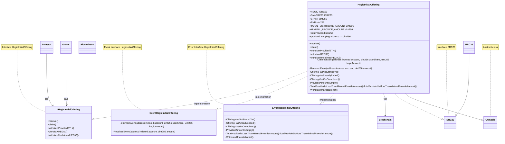

## Initial Bonding Curve Offering

- Diagram for Hegic IBCO(Initial Bonding Curve Offering)

-----

### Business logic

1. `HegicInitialOffering` contract

-----

### Using Library

1. ERC20 `openzeppelin`
2. Ownable `openzeppelin`

-----

### Actor

1. Player = Investor
2. Owner = Contract owner
3. Contract = HIBCO(Hegic Initial Bonding Curve Offering) Contract

-----

### Graph/Usecase Diagram


-----

### Class Diagram



-----

### Access Control

1. OnlyOwner = owner (contract owner) `Error handling`
    1. withdrawProvidedETH()
    2. withdrawHEGIC()
    3. withdrawUnclaimedHEGIC()

```solidity
modifier onlyOwner() { // Error handling
  require(_owner == msg.sender, "caller is only owenr.");
  _;
}
```

-----

### Event Handling

1. receive event
2. claim event

```solidity
interface { // event
  /**
   * ReceivedEvent
   * - receive ETH(payable) event
   * @param account_ address indexed
   * @param amount_ uint256
   * - using receive
  */
  event ReceivedEvent(address indexed account_, uint256 amount_)
  
  /**
   * ClaimedEvent
   * - Call Claimed event
   * @param account_ address indexed
   * @param userShare_ uint256
   * @param hegicAmount_ uint256 hegicAmount_
   * - using claim
  */
  event ClaimedEvent(address indexed account_, uint256 userShare_, uint256 hegicAmount_)
}
```

-----

### Error handling

1. OfferingHasNotStartedYet()
2. OfferingHasAlreadyEnded()
3. OfferingMustBeCompleted()
4. ProvidedAmountIsEmpty()
5. TotalProvidedIsLessThanMinimalProvideAmount()
6. TotalProvidedIsMoreThanMinimalProvideAmount()
7. WithdrawUnavailableYet()

```solidity
// list

/**
 * OfferingHasNotStartedYet
 * - `START <= block.timestam`
 * - using receive
*/
error OfferingHasNotStartedYet(address acount_, uint256 timestamp_);
/**
 * OfferingHasAlreadyEnded
 * - `block.timestamp <= END`
 * - using receive
*/
error OfferingHasAlreadyEnded(address acount_, uint256 timestamp_);

/**
 * OfferingMustBeCompleted
 * - `block.timestamp > END`
 * - using claim
 * - using withdrawProvidedETH
 * - using withdrawHEGIC
*/
error OfferingMustBeCompleted(address acount_, uint256 timestamp_);

/**
 * ProvidedAmountIsEmpty
 * - `provided[msg.sender] > 0`
 * - using claim
*/
error ProvidedAmountIsEmpty(address acount_, uint256 amount_);

/**
 * TotalProvidedIsLessThanMinimalProvideAmount
 * - `totalProvided >= MINIMAL_PROVIDE_AMOUNT`
 * - using withdrawProvidedETH
*/
error TotalProvidedIsLessThanMinimalProvideAmount(address acount_, uint256 amount_);

/**
 * TotalProvidedIsMoreThanMinimalProvideAmount
 * - `totalProvided < MINIMAL_PROVIDE_AMOUNT`
 * - using withdrawHEGIC
*/
error TotalProvidedIsMoreThanMinimalProvideAmount(address acount_, uint256 amount_);

/**
 * WithdrawUnavailableYet
 * - `END + 30 days < block.timestam`
 * - using withdrawProvidedETH
*/
error WithdrawUnavailableYet(address acount_, uint256 timestamp_);

```

1. receive `payable`
   - is START <= block.timestamp <= END
   1. `START <= block.timestamp` The offering has not started yet
   `require(START <= block.timestamp, "The offering has not started yet");`
   2. `block.timestamp <= END` The offering has already ended
   `require(block.timestamp <= END, "The offering has already ended");`

2. claim

- block.timestamp > END && provided[msg.sender] > 0
  1. `block.timestamp > END` The offering must be completed
  `require(block.timestamp > END, "The offering must be completed");`
  2. `provided[msg.sender] > 0` provided amount is empty
  `require(provided[msg.sender] > 0, "provided amount is empty");`

3. withdrawProvidedETH

- block.timestamp > END && totalProvided >= MINIMAL_PROVIDE_AMOUNT
  1. `block.timestamp > END` The offering must be completed
  `require(block.timestamp > END, "The offering must be completed");`
  2. `totalProvided >= MINIMAL_PROVIDE_AMOUNT` The required amount has not been provided
  `require(totalProvided >= MINIMAL_PROVIDE_AMOUNT,"The required amount has not been provided!");`

4. withdrawHEGIC

- block.timestamp > END && totalProvided < MINIMAL_PROVIDE_AMOUNT
  1. `block.timestamp > END` The offering must be completed
  `require(block.timestamp > END, "The offering must be completed");`
  2. `totalProvided < MINIMAL_PROVIDE_AMOUNT` The required amount has been provided
  `require(totalProvided < MINIMAL_PROVIDE_AMOUNT,"The required amount has been provided!");`

5. withdrawUnclaimedHEGIC

- END + 30 days < block.timestamp
  1. `END + 30 days < block.timestamp` Withdrawal unavailable yet
  `require(END + 30 days < block.timestamp, "Withdrawal unavailable yet");`

-----

## MEMO
